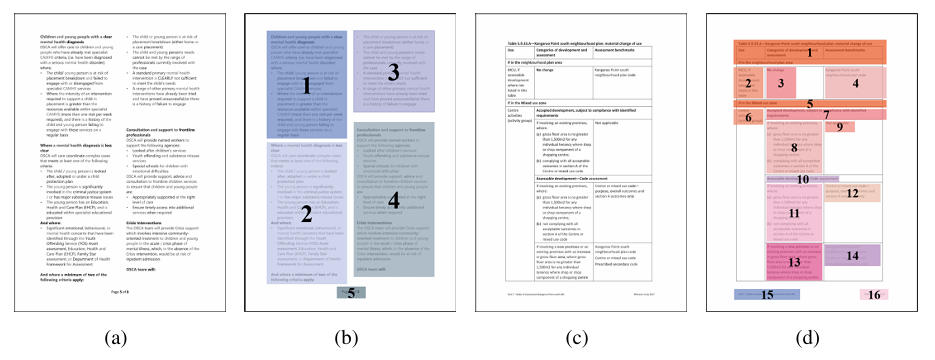
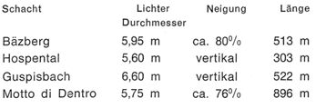
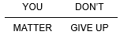
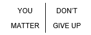
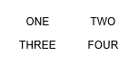
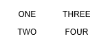

# Reading order

## Background information

Traditional OCR solutions only detect the position of every word / text line. They do not aim to detect in which order the words should be read, e.g. if the whole page can be read line-by-line from top to bottom, or if there are more complex layouts (e.g. multi-column articles) that should be considered. This challenge is usually called "text linearization" oder "reading order detection" in literature. The paper https://aclanthology.org/2021.emnlp-main.389.pdf gives the following definition:

> Reading order detection, aiming to capture the word sequence which can be naturally comprehended by human readers, is a fundamental task for visually-rich document understanding. Current off-the-shelf methods usually directly borrow the results from the Optical Character Recognition (OCR) engines (Xu et al., 2020) while most OCR engines arrange the recognized tokens or text lines in a top-to-bottom and left-to-right way (Clausner et al., 2013). Apparently, as shown in Figure 1, this heuristic method is not optimal for certain document types, such as multi-column templates, forms, invoices, and many others. An incorrect reading order will lead to unacceptable results for document understanding tasks such as the information extraction from receipts/invoices. Therefore, an accurate reading order detection model is indispensable to the document understanding tasks.
>
> 

Some solutions, such as the [AWS Textract Layout feature](https://aws.amazon.com/de/blogs/machine-learning/amazon-textracts-new-layout-feature-introduces-efficiencies-in-general-purpose-and-generative-ai-document-processing-tasks/), aim to detect various document layouts and return the detected text accordingly into a sensible reading order. However, such solutions tend to be more expensive than simple OCR models and the results might still not match the expectations, especially for complex, domain-specific document layouts (e.g. geological borehole profiles).

There is not always a single objectively _correct_ reading order for a given document. For example, some user might prefer to read a certain table row-by-row, while another user with a different perspective might be more interested in processing the data from the same table column-by-column.

> 
>
> In this table, with details about ventilation shafts in the Gotthard road tunnel, one reader might be interested in selecting/copying only the names of the different shafts without any other data, while another reader might be interested in selecting/copying all the data related to one particular shaft. There is no reading order that works equally well for both cases, as in the first case, the next word that should be selected after "Bäzberg" would be "Hospental" (_column-major order_), while in the second case, it should be "5,95 m" (_row-major order_).

Most PDF viewers follow the order in which words are _defined_ in the source of the PDF file. In order words: when opening the PDF file with such a PDF viewer, the text selection behavior is directly influenced/controlled by the order in which text from OCR is inserted in to the PDF file. However, there are some PDF viewer applications that determine their own reading order. For such applications, the text selection behavior cannot be controlled by any reading order detection during OCR post-processing.

## Implementation

This repository implements a reading order detection that works well for most of our documents. The implementation is based on a number of heuristic rules. Intuitively speaking, the reading order tries to detect and follow columns where relevant, whilst enforcing the constraint that text that is clearly above or clearly to the left of other text, should always be read first. A number of unit tests automatically verify that the reading order implementation behaves as expected.

## Limitations
The current reading order logic only considers the position (bounding box) of each word on the page. The accuracy could potentially be improved by considering additional features, such as visual page layout elements (table borders, background colors, etc.) or text semantics (i.e. the actual meaning of the words, and whether the order in which we read them produces a sensible text).

For example, the dividing line in the following example completely changes not just the most plausible reading order, but also the meaning of the text, though both images have exactly the same words in the same position:

> 
> 

Similarly, the most plausible reading order for the following examples can only be derived from the actual meaning of the words, not from their position nor from other elements of the document layout:

> 
> 

Because the reading order logic in this repository currently only considers the position of each word, it does not _see_ the difference between these examples and cannot change the detected reading order accordingly. However, in our experience on our data, there are very few examples where this actually matters. Almost always, a sensible reading order can be detected based on the word positions alone, using the current implementation.
